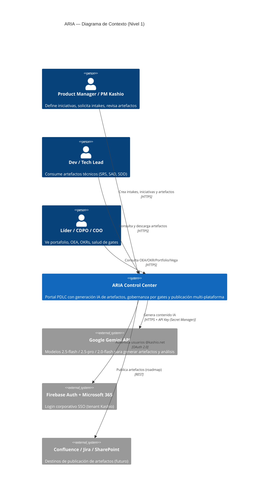
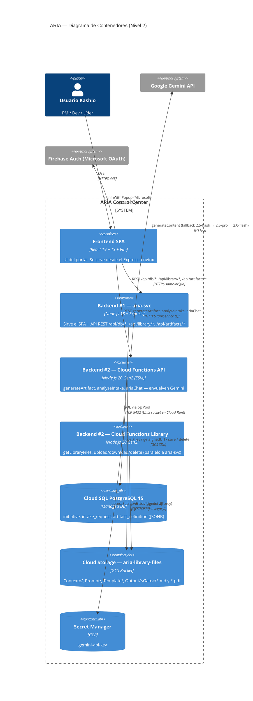
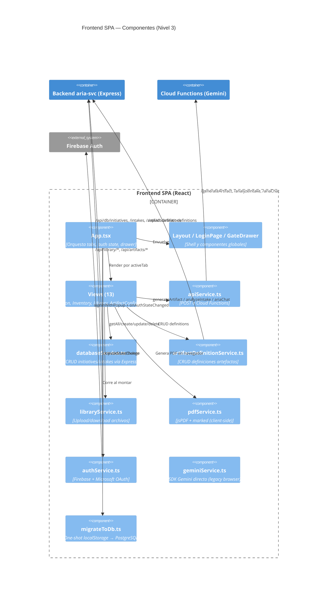
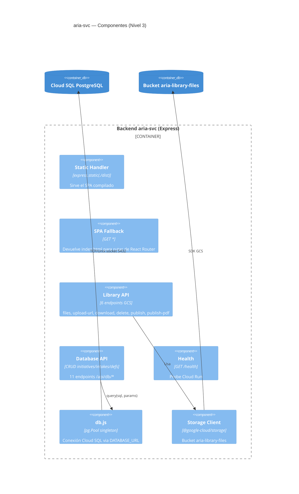
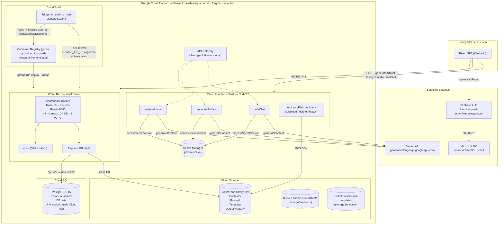
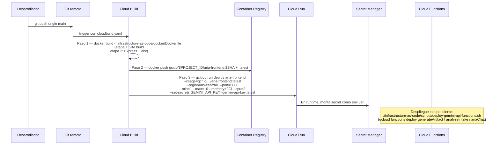
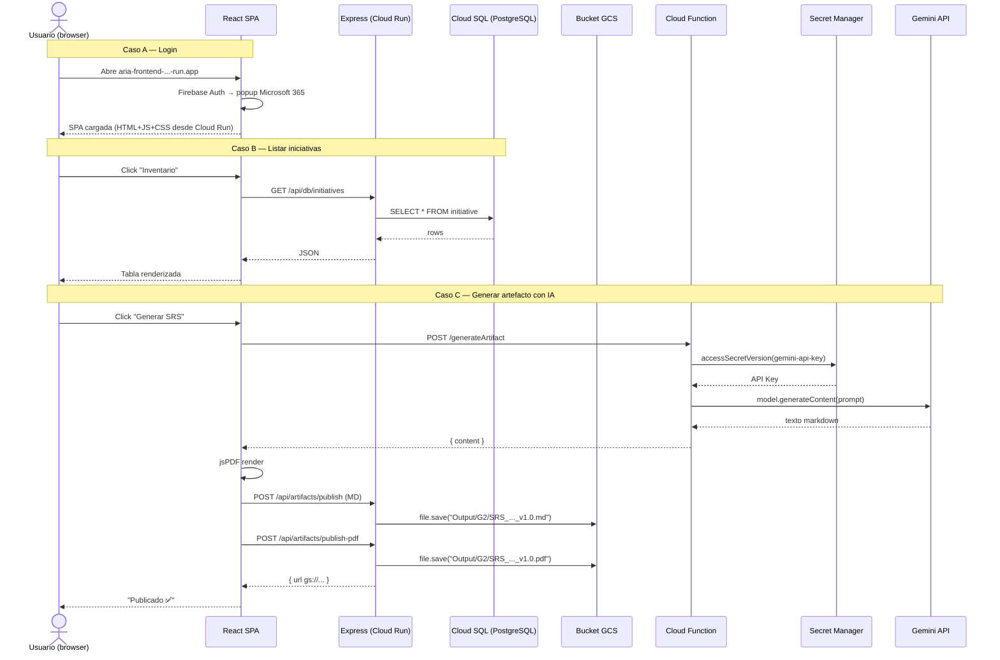
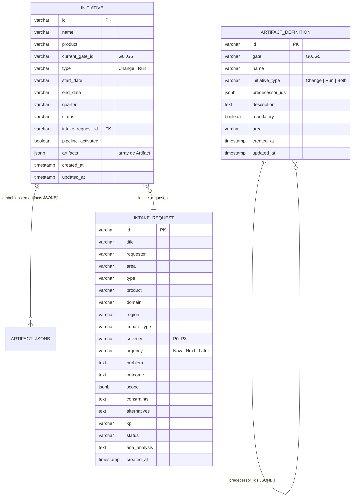

# ARIA – Arquitectura del Sistema (Modelo C4)

> **Kashio-ARIA** — *Automated Requirements & Intelligent Artifacts*
>
> Sistema enterprise-grade de gestión y gobernanza del **Product Development Life Cycle (PDLC)** de Kashio Fintech, con generación automática de artefactos mediante IA (Gemini), flujos Human-in-the-Loop (HITL) y publicación multi-plataforma.

---

## 0. Aclaración previa importante

> El proyecto **no usa Supabase**. La base de datos es **Google Cloud SQL for PostgreSQL 15 nativo**, accedida directamente vía el driver `pg` desde el backend Express (ver `back/aria-svc/db.js`). El resto del documento refleja el stack **real** detectado en el código.

---

## 1. Finalidad del proyecto (en lenguaje simple)

ARIA es un **portal interno de Kashio** que sirve para **gobernar cómo nacen, se diseñan y se entregan los productos digitales** de la empresa (Kashio Cards, Conexión Única, Kashio AI, etc.).

Lo hace a través de un flujo llamado **PDLC** que se divide en compuertas o *Gates* (**G0 → G5**). En cada gate se exigen ciertos **artefactos** (documentos como SRS, SAD, SDD, User Story Map, etc.). ARIA ayuda a:

1. **Recibir solicitudes de trabajo** (Intake) de cualquier área.
2. **Analizarlas con IA** (Gemini) para recomendar la ruta del PDLC (Fast Track / Discovery / Estándar).
3. **Convertir intakes aprobados en iniciativas** y llevarlas por las gates.
4. **Generar automáticamente los artefactos** de cada gate (con IA), revisarlos en HITL, versionarlos y publicarlos como Markdown + PDF.
5. **Tener una librería central** (Contexto, Prompts, Templates, Outputs) en Cloud Storage que alimenta la generación.
6. **Dar visibilidad ejecutiva** (OEA, OKRs, Portfolio, Observatorio Vega, Squad Governance, KPC Catalog).

En una frase: **ARIA es el "cerebro" que estandariza, automatiza y gobierna todo el ciclo de vida de los productos de Kashio.**

---

## 2. Estructura de carpetas (nivel raíz)

```
Kashio-ARIA/
├── .foundation/                  # Placeholder reservado (futuros assets base)
├── back/                         # Todo el backend
│   ├── aria-svc/                 # Backend #1 — Servidor Express (Cloud Run)
│   └── functions/                # Backend #2 — Cloud Functions (serverless)
│       ├── api/                  # Funciones de IA (Gemini)
│       ├── library/              # Funciones de archivos (legacy/paralelo)
│       └── storage/              # Reservado
├── database/                     # SQL y esquemas
│   ├── migrations/               # Migraciones PostgreSQL versionadas
│   └── schema/                   # Diagramas/esquemas de referencia
├── front/
│   └── mfe-aria-portal/          # Frontend React + Vite + TypeScript
├── infrastructure-as-code/       # Toda la infra como código
│   ├── ci/                       # Cloud Build (pipelines CI/CD)
│   ├── docker/                   # Dockerfiles y nginx.conf
│   ├── gcp/                      # Configs GCP (API Gateway, Secret Manager)
│   ├── k8s/                      # Reservado (futuro Kubernetes)
│   └── scripts/                  # Bash scripts de deploy/ops
├── tests/
│   └── qa-automation/            # Reservado para tests QA
├── Dockerfile                    # Duplicado raíz (gcloud run deploy --source .)
├── cloudbuild.yaml               # Duplicado raíz (trigger Cloud Build)
├── .dockerignore                 # Exclusiones del contexto Docker
├── .gitignore                    # Exclusiones de git
└── README.md                     # Descripción breve del proyecto
```

### ¿Por qué hay un `Dockerfile` y `cloudbuild.yaml` duplicados en la raíz?

Google Cloud Build y `gcloud run deploy --source .` **buscan estos archivos en la raíz del repo por convención**. Los canónicos viven en `infrastructure-as-code/`, pero se duplican arriba para que los triggers automáticos funcionen sin configuración extra.

---

## 3. Estructura de carpetas (detalle con propósito)

### 3.1 `front/mfe-aria-portal/` — Frontend SPA

Aplicación **React 19 + TypeScript + Vite 6 + TailwindCSS** (vía CDN/typography). Es un **Micro-Frontend** (mfe) del Portal ARIA.

```
front/mfe-aria-portal/
├── assets/                   # Recursos estáticos de negocio
│   ├── csv/                  # Catálogo KPC L3, Matrix, Projects Mapped, Iniciativas 2026
│   ├── excel/                # OKR Iniciativas, PDLC Artefactos, Inventario Plantillas
│   ├── pdf/                  # KPC Catalog Playbook
│   └── word/                 # Arquitectura ARIA (documento fuente)
├── src/
│   ├── components/           # Componentes UI reutilizables
│   │   ├── AriaAgentBot.tsx      # Chatbot flotante con IA
│   │   ├── ConfirmModal.tsx      # Modal de confirmación
│   │   ├── GateDetailDrawer.tsx  # Drawer lateral con detalle de gate
│   │   ├── Layout.tsx            # Shell/header/sidebar de la app
│   │   ├── LoginPage.tsx         # Pantalla de login Microsoft 365
│   │   ├── SearchableSelect.tsx  # Combobox con búsqueda
│   │   └── Timeline.tsx          # Línea de tiempo G0→G5
│   ├── config/               # Configuraciones runtime
│   ├── constants/
│   │   └── constants.tsx         # Constantes del negocio (PORTFOLIO_2026, gates, etc.)
│   ├── data/
│   │   └── artifactsFromOrder.ts # Dataset estático de artefactos por orden
│   ├── hooks/                # React hooks personalizados
│   ├── services/             # Capa de integración (llama a APIs)
│   │   ├── apiService.ts             # → Cloud Functions (Gemini)
│   │   ├── artifactDefinitionService.ts # → Express /api/db/artifact-definitions
│   │   ├── authService.ts            # → Firebase Auth + Microsoft OAuth
│   │   ├── databaseService.ts        # → Express /api/db/initiatives, /intakes
│   │   ├── geminiService.ts          # → Gemini SDK directo (legacy/browser)
│   │   ├── libraryService.ts         # → Express /api/library/*
│   │   ├── pdfService.ts             # Genera PDFs con jsPDF (client-side)
│   │   └── storageService.ts         # → Cloud Storage (server-side SDK)
│   ├── types/
│   │   └── types.ts              # Interfaces TS (Initiative, Artifact, Gate, etc.)
│   ├── utils/                # Utilidades
│   │   ├── clearStorage.ts       # Limpia localStorage
│   │   ├── debugStorage.ts       # Imprime contenido del storage
│   │   ├── generationLogger.ts   # Logs de generación IA
│   │   ├── migrateToDb.ts        # Migra localStorage → PostgreSQL
│   │   └── resetDatabase.ts      # Reset de estado local
│   ├── views/                # Páginas principales (ruteadas por tab)
│   │   ├── ArtifactConfig.tsx    # Catálogo de definiciones de artefactos
│   │   ├── Generation.tsx        # Motor de generación IA de artefactos
│   │   ├── Governance.tsx        # Gobernanza general del PDLC
│   │   ├── Intake.tsx            # Formulario y listado de solicitudes
│   │   ├── Inventory.tsx         # Inventario de iniciativas y artefactos
│   │   ├── KpcCatalog.tsx        # Catálogo de productos KPC (Kashio Product Catalog)
│   │   ├── Library.tsx           # Librería de archivos (Cloud Storage)
│   │   ├── OeaStrategy.tsx       # Objetivos Estratégicos Anuales
│   │   ├── Overview.tsx          # Vista resumen de una iniciativa
│   │   ├── Portfolio.tsx         # Portafolio 2026
│   │   ├── Prioritization.tsx    # Priorización RICE/WSJF
│   │   ├── SquadGovernance.tsx   # Gobernanza por squad
│   │   └── VegaObservatory.tsx   # Observatorio Vega (métricas de entrega)
│   ├── App.tsx               # Componente raíz + routing por tabs
│   └── index.tsx             # Bootstrap React
├── index.html                # HTML de entrada (Vite)
├── package.json              # Dependencias NPM
├── tsconfig.json             # Config TypeScript
└── vite.config.ts            # Config Vite (build, server, env)
```

### 3.2 `back/aria-svc/` — Backend #1 (Express + Cloud Run)

Servidor **Express 4 (Node.js 18)** que cumple **dos roles a la vez**:

1. **Sirve el frontend compilado** (`dist/` como estáticos).
2. **Expone la API REST** que consume el front (`/api/library/*`, `/api/artifacts/*`, `/api/db/*`).

```
back/aria-svc/
├── index.js          # Servidor Express completo (694 líneas)
├── db.js             # Conexión PostgreSQL (pool pg) vía DATABASE_URL
├── package.json      # Deps: express, cors, pg, @google-cloud/storage
└── package-lock.json
```

### 3.3 `back/functions/` — Backend #2 (Cloud Functions Gen 2)

Funciones **serverless** que se ejecutan solo cuando el usuario las invoca (event-driven, no hay servidor corriendo 24/7).

```
back/functions/
├── api/              # Funciones de IA (Gemini)
│   ├── index.js          # 3 endpoints HTTP: generateArtifact, analyzeIntake, ariaChat + health
│   └── package.json      # Deps: functions-framework, generative-ai, secret-manager, cors
├── library/          # Funciones de librería (legacy, reemplazadas por aria-svc)
│   ├── index.js          # 4 endpoints: getLibraryFiles, getUploadUrl, download, delete
│   └── package.json
└── storage/          # Reservado (solo package.json)
```

### 3.4 `database/` — Esquema PostgreSQL

```
database/
├── migrations/
│   ├── 001_initial_schema.sql     # Schema v1 (oea, okr, key_result, portfolio_initiative,
│   │                              #   artifact, artifact_destination, intake_request, kpc_product)
│   └── 002_aria_current_schema.sql # Schema v2 (initiative con artifacts JSONB,
│                                  #   intake_request, artifact_definition) — ACTUAL
└── schema/                        # Reservado para diagramas ER
```

### 3.5 `infrastructure-as-code/` — IaC

```
infrastructure-as-code/
├── ci/
│   └── cloudbuild.yaml           # Pipeline CI/CD canónico (build → push → deploy Cloud Run)
├── docker/
│   ├── Dockerfile                # Imagen canónica: Vite build + Express (multi-stage)
│   ├── Dockerfile.express        # Variante con npm ci --only=production
│   ├── Dockerfile.nginx          # Alternativa solo SPA estática con nginx
│   └── nginx.conf                # Config nginx: SPA routing + proxy /api/library/ → Cloud Functions
├── gcp/
│   ├── api-gateway-config.yaml   # Swagger 2.0 para Google API Gateway (Cloud Functions)
│   └── secret-policy.yaml        # IAM binding para secretmanager.secretAccessor
├── k8s/                          # Reservado para manifiestos Kubernetes
└── scripts/
    ├── deploy-cloudrun.sh             # Build local Docker + push GCR + deploy Cloud Run
    ├── deploy-cloudrun-simple.sh      # Deploy vía `gcloud run deploy --source .` (Cloud Build)
    ├── deploy-now.sh                  # Deploy rápido con secret GEMINI_API_KEY
    ├── final-cloudrun-setup.sh        # Asocia Secret Manager al servicio
    ├── deploy-gemini-api-functions.sh # Despliega las 3 Cloud Functions de IA
    ├── deploy-library-functions.sh    # Despliega las 4 Cloud Functions de librería
    ├── setup-cloudsql.sh              # Instrucciones para aplicar migraciones en Cloud SQL
    ├── ejecutar-migracion-011.sh      # Migración ad-hoc (numeración G2)
    ├── limpiar-duplicados-initiatives.sh # Limpieza de duplicados
    └── push-hint.sh                   # Recordatorio de push + link Cloud Build
```

---

## 4. Modelo C4 — Diagramas de Arquitectura

### 4.1 Nivel 1 — **Diagrama de Contexto** (System Context)



**Usuarios:**

- **PMs** crean intakes y gobiernan iniciativas.
- **Devs / Tech Leads** consumen artefactos técnicos.
- **Líderes ejecutivos** ven portafolio, OEA, OKRs, salud del PDLC.

**Sistemas externos:**

- **Gemini API** (Google): motor de IA.
- **Firebase Identity Platform + Microsoft 365** (Azure AD tenant `4cb14595-301a-44ee-af4e-33b9bb64c9c4`): autenticación SSO.
- **Confluence / Jira / SharePoint**: destinos futuros de publicación.

---

### 4.2 Nivel 2 — **Diagrama de Contenedores** (Containers)



#### Contenedores — resumen por rol

| Contenedor | Tecnología | Runtime | Rol |
|---|---|---|---|
| **Frontend SPA** | React 19, Vite 6, TypeScript 5.8, TailwindCSS, Recharts, Lucide, jsPDF, `react-markdown` | Navegador | UI de todo el portal |
| **Backend #1 `aria-svc`** | Express 4, `pg`, `@google-cloud/storage` | Cloud Run (Node 18) | API REST + servidor de estáticos del SPA |
| **Backend #2 `functions/api`** | Cloud Functions Gen2 + `@google/generative-ai` + Secret Manager | Cloud Functions (Node 20, ESM) | Endpoints IA (Gemini) |
| **Backend #2 `functions/library`** | Cloud Functions Gen2 + `@google-cloud/storage` | Cloud Functions (Node 20) | Endpoints de archivos (paralelo/legacy) |
| **Cloud SQL PostgreSQL** | PostgreSQL 15 managed | GCP | Persistencia transaccional |
| **Cloud Storage** | Bucket `aria-library-files` | GCP | Archivos, templates, outputs MD y PDF |
| **Secret Manager** | `gemini-api-key` | GCP | Custodia de credenciales |
| **Firebase Identity Platform** | Firebase Auth + Microsoft OAuth Provider | GCP/Azure AD | SSO corporativo |

#### ¿Por qué dos backends?

- **`aria-svc` (Backend #1, Cloud Run):** servidor **siempre corriendo** (`min-instances=1`). Sirve el SPA y expone endpoints que requieren conexión persistente a **Cloud SQL** y al **bucket** (patrón CRUD clásico).
- **`functions/api` (Backend #2, Cloud Functions):** endpoints **efímeros, event-driven**. Se "despiertan" solo cuando el usuario dispara una acción IA. No están corriendo 24/7 → cuestan menos y escalan elásticamente. Tienen acceso exclusivo a **Secret Manager** para proteger la API Key de Gemini.

> **La clave de seguridad:** la API Key de Gemini **nunca llega al navegador**. El front llama a la Cloud Function (autenticación por IAM), la función lee la key desde Secret Manager y luego llama a Gemini. El usuario jamás la ve.

---

### 4.3 Nivel 3 — **Diagrama de Componentes** (Components)

#### 4.3.1 Componentes del Frontend (React SPA)



**Patrón de fallback en cliente:** `databaseService` y `artifactDefinitionService` intentan siempre llamar al API y, si falla, caen a `localStorage`. Cuando vuelven a tener conexión, `migrateToDb.ts` sube lo pendiente al PostgreSQL.

#### 4.3.2 Componentes del Backend `aria-svc` (Express)



#### Endpoints del Backend #1 (`aria-svc`) — Enumerados

| Método | Ruta | Función | Consume del front |
|---|---|---|---|
| `GET` | `/health` | Health check Cloud Run | — |
| `GET` | `/api/db/health` | Test conexión PostgreSQL | `databaseService` |
| `GET` | `/api/db/initiatives` | Lista iniciativas | `getAllInitiatives` |
| `POST` | `/api/db/initiatives` | Crea iniciativa | `createInitiative` |
| `PUT` | `/api/db/initiatives/:id` | Actualiza iniciativa | `updateInitiative` |
| `DELETE` | `/api/db/initiatives/:id` | Elimina iniciativa | `deleteInitiative` |
| `GET` | `/api/db/intakes` | Lista intakes | `getAllIntakeRequests` |
| `POST` | `/api/db/intakes` | Crea intake | `createIntakeRequest` |
| `PUT` | `/api/db/intakes/:id` | Actualiza intake | `updateIntakeRequest` |
| `GET` | `/api/db/artifact-definitions` | Lista definiciones de artefactos | `getAllArtifactDefinitions` |
| `POST` | `/api/db/artifact-definitions` | Crea definición | `createArtifactDefinition` |
| `PUT` | `/api/db/artifact-definitions/:id` | Actualiza definición | `updateArtifactDefinition` |
| `DELETE` | `/api/db/artifact-definitions/:id` | Elimina definición | `deleteArtifactDefinition` |
| `GET` | `/api/library/files` | Lista archivos del bucket (filtrados + versión más reciente) | `getAllLibraryFiles` |
| `POST` | `/api/library/upload-url` | Devuelve URL firmada V4 de escritura (15 min) | `getUploadSignedUrl` |
| `GET` | `/api/library/download/:fileId` | URL firmada V4 de lectura | `downloadLibraryFile` |
| `DELETE` | `/api/library/delete/:fileId` | Elimina archivo | `deleteLibraryFile` |
| `GET` | `/api/artifacts/files` | Lista archivos en `Output/` | `Library.tsx` |
| `POST` | `/api/artifacts/publish` | Publica artefacto Markdown en `Output/<Gate>/` | `publishArtifactContent` |
| `POST` | `/api/artifacts/publish-pdf` | Publica PDF (raw bytes) en `Output/<Gate>/` | `publishArtifactPdf` |
| `GET` | `/*` | SPA fallback → `dist/index.html` | React Router |

#### Endpoints del Backend #2 (Cloud Functions) — Enumerados

| Función | URL | Rol | Modelos |
|---|---|---|---|
| `generateArtifact` | `POST https://us-central1-kashio-squad-nova.cloudfunctions.net/generateArtifact` | Genera outline/contenido de un artefacto | gemini-2.5-flash → 2.5-pro → 2.0-flash (fallback) |
| `analyzeIntake` | `POST .../analyzeIntake` | Analiza un intake y recomienda ruta PDLC | idem |
| `ariaChat` | `POST .../ariaChat` | Chatbot ARIA (experto PDLC Kashio) | idem |
| `health` | `GET .../health` | Health check | — |
| `getLibraryFiles` | `GET .../getLibraryFiles` | *(legacy)* Lista bucket | — |
| `getLibraryUploadUrl` | `POST .../getLibraryUploadUrl` | *(legacy)* URL firmada de upload | — |
| `downloadLibraryFile` | `GET .../downloadLibraryFile/:id` | *(legacy)* URL firmada de download | — |
| `deleteLibraryFile` | `DELETE .../deleteLibraryFile/:id` | *(legacy)* Borrado | — |

> Las funciones de `library/` son **paralelas/legacy**: hoy el front usa las equivalentes de `aria-svc` (mismo-origen vía `/api/library/*`). El `nginx.conf` alternativo sí las proxeaba cuando el front se servía con nginx puro.

---

### 4.4 Nivel 4 — **Diagrama de Código / Deployment** (Deployment Diagram)



---

## 5. Modelo de Despliegue (paso a paso)

### 5.1 ¿Qué se despliega y cómo?

| Componente | Destino GCP | Cómo se despliega | Cuándo |
|---|---|---|---|
| **Frontend SPA** | Empaquetado dentro del contenedor `aria-frontend` | `vite build` → `dist/` → COPY al contenedor | Cada push a `main` (Cloud Build) |
| **Backend #1 `aria-svc`** | **Cloud Run** (`aria-frontend`, us-central1) | Imagen Docker multi-stage (ver `infrastructure-as-code/docker/Dockerfile`) | Cada push a `main` (Cloud Build) |
| **Backend #2 `functions/api`** | **Cloud Functions Gen2** | `gcloud functions deploy` (script `deploy-gemini-api-functions.sh`) | Manual / on-demand |
| **Backend #2 `functions/library`** | **Cloud Functions Gen2** | `gcloud functions deploy` (script `deploy-library-functions.sh`) | Manual / on-demand |
| **Cloud SQL** | Instancia `aria-db` | Aplicar migraciones SQL con `gcloud sql connect` | Manual (puntual) |
| **Cloud Storage** | Bucket `aria-library-files` | Creado una sola vez (console/gcloud) | Manual |
| **Secret Manager** | Secreto `gemini-api-key` | `gcloud secrets create` + binding IAM | Manual |

### 5.2 Pipeline de despliegue continuo (CI/CD)

**Disparador:** `git push origin main`.



### 5.3 Cómo viaja una petición del usuario (runtime)



---

## 6. Conexiones de arquitectura — Inventario completo

| # | Origen | Destino | Protocolo | Propósito |
|---|---|---|---|---|
| 1 | Navegador | Cloud Run `aria-frontend` | HTTPS 443 | Descarga del SPA (HTML/JS/CSS) |
| 2 | Navegador | Cloud Run `aria-frontend` | HTTPS (same-origin) | API REST `/api/db/*`, `/api/library/*`, `/api/artifacts/*` |
| 3 | Navegador | Cloud Functions `generateArtifact` / `analyzeIntake` / `ariaChat` | HTTPS + CORS | Generación IA (vía `apiService.ts`) |
| 4 | Navegador | Firebase Auth | HTTPS + OAuth 2.0 | Login SSO Microsoft 365 |
| 5 | Firebase Auth | Azure AD (tenant Kashio) | OAuth 2.0 | Validación federada |
| 6 | Navegador | Signed URL de Cloud Storage | HTTPS PUT/GET | Upload/Download directo sin pasar por el backend |
| 7 | Cloud Run `aria-svc` | Cloud SQL PostgreSQL 15 | TCP/Unix socket 5432 (`pg` pool, `DATABASE_URL`) | CRUD transaccional |
| 8 | Cloud Run `aria-svc` | Bucket `aria-library-files` | GCS SDK (HTTPS + SA IAM) | Listar, firmar URLs, publicar MD/PDF |
| 9 | Cloud Functions API | Secret Manager (`gemini-api-key`) | GCP IAM (`secretmanager.secretAccessor`) | Obtener API key sin exponerla |
| 10 | Cloud Functions API | Gemini API | HTTPS + API Key | Llamar modelos `gemini-2.5-flash/pro`, `2.0-flash` |
| 11 | Cloud Functions Library (legacy) | Bucket `aria-library-files` | GCS SDK | Listar/upload/download/delete (uso histórico) |
| 12 | Cloud Build | Container Registry (`gcr.io`) | Docker Registry API | Push de imagen `aria-frontend:$SHA` y `:latest` |
| 13 | Cloud Build | Cloud Run | `gcloud run deploy` | Despliegue de imagen nueva |
| 14 | Cloud Run | Secret Manager | `--set-secrets` en runtime | Monta `GEMINI_API_KEY` como env var |
| 15 | API Gateway (opcional) | Cloud Functions | JWT audience + backend address | Fachada pública unificada (archivo `api-gateway-config.yaml`) |
| 16 | Dev | Cloud SQL | `gcloud sql connect` (IAM) | Aplicar migraciones `001_*`, `002_*` |
| 17 | `aria-svc` (runtime) | Cloud Logging | Stdout | `console.log` → Cloud Logging |
| 18 | Cloud Functions | Cloud Logging | Stdout | Idem |

**Servicios GCP utilizados:**

1. **Cloud Run** (hosting del contenedor front + backend #1).
2. **Cloud Functions Gen2** (backend #2, serverless).
3. **Cloud SQL for PostgreSQL 15** (base de datos).
4. **Cloud Storage** (buckets: `aria-library-files`, `kashio-aria-artifacts`, `kashio-aria-templates`).
5. **Secret Manager** (`gemini-api-key`).
6. **Container Registry / Artifact Registry** (imágenes Docker).
7. **Cloud Build** (CI/CD automático).
8. **Cloud Logging** (logs centralizados).
9. **API Gateway** (definido pero opcional).
10. **IAM** (service account `215989210525-compute@developer.gserviceaccount.com` con `secretmanager.secretAccessor`).
11. **Firebase Identity Platform** (autenticación) — con federación a **Microsoft 365 / Azure AD**.
12. **Gemini API** (Google AI).

---

## 7. Modelo de datos (resumen del schema v2)



> El schema v1 (`001_initial_schema.sql`) tenía un modelo más granular (`oea`, `okr`, `key_result`, `portfolio_initiative`, `artifact`, `artifact_destination`, `kpc_product`). El schema v2 lo **aplana**, guardando los artefactos como **JSONB dentro de `initiative`**, porque simplifica el API y aprovecha la flexibilidad del documento.

---

## 8. Gobernanza, seguridad y buenas prácticas detectadas

- **Cero secretos en el cliente**: la API Key de Gemini vive solo en **Secret Manager** y solo la leen las Cloud Functions.
- **Fallback de modelos IA**: si `gemini-2.5-flash` falla → `gemini-2.5-pro` → `gemini-2.0-flash`.
- **Fallback de storage**: si el API REST falla, el front usa `localStorage` y luego sincroniza vía `migrateToDb.ts`.
- **URLs firmadas V4 (15 min)** para todo upload/download directo a GCS → el backend nunca recibe el binario del usuario.
- **CORS restringido** en Cloud Functions a dominios Kashio conocidos.
- **SSO corporativo** limitado a `@kashio.net`, `@kashio.us`, `@kashio.com`.
- **CSP + headers de seguridad** en `nginx.conf` para la variante estática.
- **Versionado semántico** en los artefactos publicados (`_v1.0.md`, `_v2.0.md`...) con "latest-per-artifact" calculado en el backend.
- **Health checks** en Docker (`/health`) + Cloud Run (probe).
- **Multi-stage Docker build** para reducir tamaño de imagen final.

---

## 9. Resumen ejecutivo (una página)

- ARIA es el **portal de gobernanza del PDLC** de Kashio, construido como un **mono-repo** con 3 piezas: **frontend React**, **backend Express** y **backend serverless Cloud Functions**.
- Se **despliega** en **Google Cloud Run** (front + backend #1 en un mismo contenedor Docker, vía Cloud Build) y **Cloud Functions Gen2** (backend #2 para IA).
- **Persiste datos** en **Cloud SQL for PostgreSQL 15** (no Supabase) con un esquema simple de 3 tablas clave (`initiative`, `intake_request`, `artifact_definition`).
- **Almacena archivos** en **Cloud Storage** (bucket `aria-library-files` con carpetas Contexto / Prompt / Template / Output).
- **Autentica** con **Firebase + Microsoft 365 SSO** (tenant corporativo).
- **Genera contenido IA** vía **Gemini** (2.5-flash / pro con fallback), protegiendo la API Key en **Secret Manager**.
- **Publica artefactos** como Markdown + PDF al bucket, y está preparado (no implementado aún) para publicar también a **Confluence / Jira / SharePoint**.
- Todo **corre en `us-central1`, proyecto `kashio-squad-nova`**.
